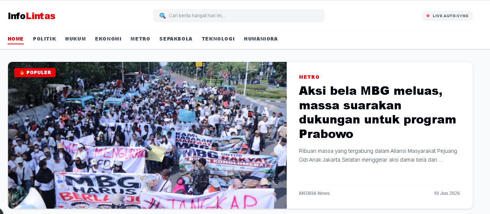
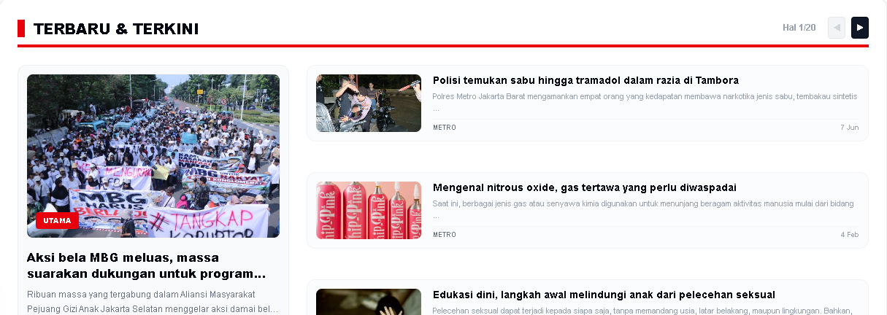
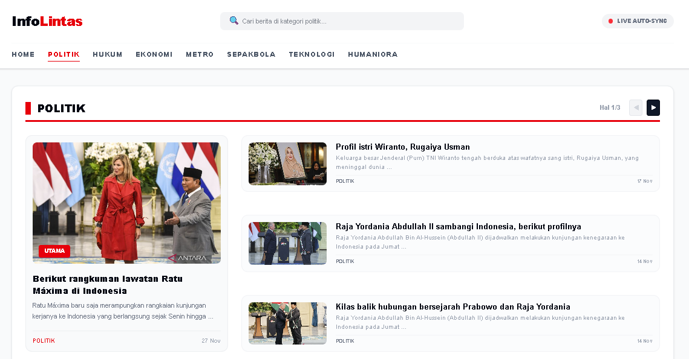
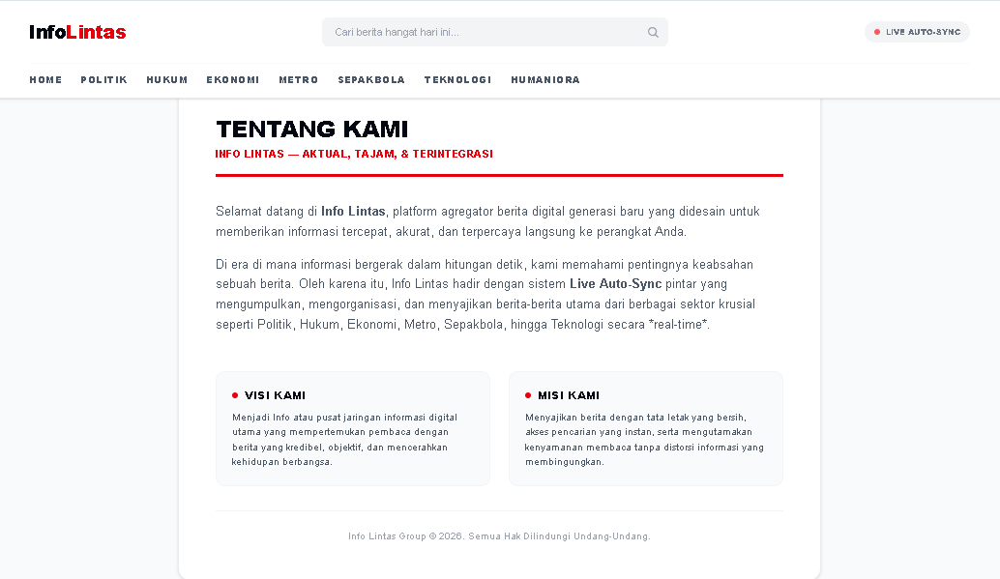

# 🚀 INFO LINTAS - PORTAL BERITA OTOMATIS

### 📑 [Spesifikasi: Next.js 15+ | MongoDB Mongoose | Tailwind CSS v4.0]

---

**Info Lintas** adalah aplikasi web portal berita multi-kategori berperforma tinggi yang dibangun di atas framework **Next.js (App Router)**. Aplikasi ini memanfaatkan arsitektur *Server Components* untuk kecepatan pemuatan halaman maksimal, penanganan database dinamis lewat **Mongoose**, serta komponen slider interaktif otomatis menggunakan library **Swiper.js** tanpa mengorbankan performa SEO.

---

## 📸 Preview Tampilan Aplikasi

Berikut adalah galeri screenshot antarmuka dari aplikasi **Info Lintas** yang diambil langsung dari sistem:

### 🖥️ Beranda / Halaman Utama




### 📰 Halaman Kategori Politik & Halaman Tentang Kami
<table width="100%">
  <tr>
    <td width="50%" align="center">
      
      <br /><i>Kategori Berita Politik</i>
    </td>
    <td width="50%" align="center">
      
      <br /><i>Halaman Profil / Tentang Kami</i>
    </td>
  </tr>
</table>

---

## ✨ Fitur Utama Sistem

* ⚡ **Hybrid Dynamic Rendering (`force-dynamic`):** Menjamin berita yang disajikan selalu segar dan ditarik langsung dari MongoDB pada setiap request tanpa tertahan cache statis server.
* 🔍 **Pencarian Cerdas Multi-Kategori:** Fitur pencarian berbasis ekspresi reguler (*Regex Case-Insensitive*) yang memindai kecocokan kata kunci pada judul sekaligus ringkasan artikel secara simultan.
* 📑 **State Pagination Terisolasi:** Navigasi halaman yang dikelola per blok kategori melalui URL parameters (`?page_politik=2`), memastikan perpindahan halaman di satu kategori tidak merusak posisi layout kategori lainnya.
* 🎚️ **Slider Swiper.js Anti-Hydration:** Komponen slider interaktif pada bagian bawah halaman yang meluncur otomatis secara horizontal dengan proteksi siklus render untuk mencegah misinformasi waktu lokal pada browser.

---

## 🛠️ Tech Stack & Spesifikasi

| Komponen | Teknologi | Peran / Deskripsi |
| :--- | :--- | :--- |
| **Framework** | Next.js (App Router) | Mengelola Server-Side Rendering (SSR) & Optimalisasi Core Web Vitals |
| **Database ORM** | Mongoose / MongoDB | Mengatur skema berita, pencarian regex, dan sorting kronologis |
| **Styling** | Tailwind CSS v4.0 | Utilitas konfigurasi berbasis `@theme` CSS langsung tanpa berkas config JS |
| **Slider Engine** | Swiper.js Component | Menggerakkan daftar berita bawah secara meluncur otomatis (*Autoplay Loop*) |

---

## 🏗️ Struktur Pembuatan Proyek (Step-by-Step)

Jika Anda ingin membangun atau merekonstruksi ulang proyek ini dari nol, ikuti langkah-langkah teknis berikut yang sudah dipisah per berkas:

☕ **Dukung Pengembangan Proyek**
Jika arsitektur kode robot scraper atau sistem web portal berita ini bermanfaat bagi proses belajar Anda, Anda bisa memberikan dukungan apresiasi dengan memindai kode QR langsung menggunakan aplikasi e-wallet (Dana/OVO/Gopay/LinkAja) atau melalui tautan Saweria berikut:

<p align="left">
  
  <br />
  👉 <b><a href="https://saweria.co/RizalFirmansyah" target="_blank">Klik Disini Untuk Traktir Kopi via Saweria</a></b>
</p>

*Apresiasi Anda sangat membantu dalam menjaga konsistensi riset pengembangan kode yang bersih dan performa tinggi!*

### 1. Inisialisasi Environment & Install Library
Jalankan perintah ini di terminal Anda untuk membuat kerangka dasar proyek Next.js baru dan memasang library Mongoose:

```bash
npx create-next-app@latest info-lintas --js --tailwind --app --src-dir=false
cd info-lintas
npm install mongoose swiper